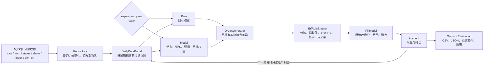

# QMT 日频 ETF 回测项目：整体框架与开发说明

本文档面向准备理解或修改核心框架的开发者。只需要填写 MySQL、编写 Rule/Model 并运行回测
的用户，请先阅读 [普通用户使用说明](README.md)。

## 1. 项目定位

这是一个 Python 3.12 日频 ETF 回测框架。生产数据从统一的 MySQL `qmt_etf_quant` 数据库
只读加载，策略、模型训练、撮合、账户记账、指标和结果文件全部在本地完成。

框架把“用户可以自由修改的研究逻辑”和“必须统一执行的交易与账户逻辑”分开：

- 用户只在 `private_strategy/<实验名>/` 编辑证券池、Rule 或 Model；
- 框架负责数据库读取、时序隔离、订单生成、交易规则、成交、账户和结果；
- 汇金只是一个可选数据接口和示例策略，不是核心框架的固定路径。

## 2. 当前能够实现的功能

### 数据与证券池

- 使用个人 MySQL 只读账号连接统一的 `qmt_etf_quant`；
- 加载 ETF 原始未复权日行情、等比前复权日行情、交易状态、每日份额和 ETF 主数据；
- 为 Rule 加载配置的指数日行情；
- 从项目内 CSV 加载可选的汇金持有比例；
- 使用显式证券列表、预定义 ETF 资产池或二者并集；
- 根据上市/退市日期控制回测区间中的证券有效性；
- 使用统一的上交所交易日历推进沪深 ETF 日频 Frame。

### Rule 策略

- 动态加载每个实验自己的 `rule.py`；
- 自定义回看长度、调仓间隔、目标仓位和任意 JSON 兼容策略参数；
- 读取截至信号日的前复权 OHLCV、停牌状态、现金和只读持仓；
- 读取当前权重、ETF 每日份额、汇金比例及配置指数历史；
- 返回多证券目标权重、全部持币目标或 `NO_REBALANCE`；
- 支持选股、过滤、轮动、择时、多资产配置和空仓规则。

### Model 策略

- 动态加载每个实验自己的 `model.py`；
- 自定义单证券时序特征和 PyTorch `nn.Module`；
- 自定义训练/验证日期、随机种子、轮数、早停、batch、学习率和权重衰减；
- 固定使用 D+1 到 D+2 的前复权收益标签；
- 只用训练集拟合 StandardScaler；
- 使用验证集早停，并在一次运行中只训练一次；
- 通过等权、分数比例、Softmax 或受校验的自定义方法生成 Top-K 组合；
- 保存模型 bundle、逐日预测和训练/验证/测试指标。

### 交易、账户与输出

- D 日收盘产生目标，最早在 D+1 合法交易日收盘成交；
- 统一处理停牌、方向性涨跌停、T+0/T+1、整手和成交量上限；
- 卖单先于买单，买单受现金、费用和滑点约束；
- 保留全部订单，包括未成交和被拒绝订单；
- 只有正式成交结果可以修改账户；
- 每次运行创建新的结果目录，不覆盖既有结果；
- 输出净值、持仓、订单、成交、指标、最终账户和图表；
- 冻结非秘密配置、数据版本、资源摘要和策略/模型来源摘要，便于追溯。

## 3. 当前不支持的功能边界

- 不支持分钟、小时、Tick 或其他非日频周期；
- 不支持开盘、VWAP、TWAP、盘中价格或其他成交时点，当前固定为收盘执行；
- 不支持股票、债券、期货、期权、外汇和加密资产，当前证券域是境内股票 ETF 与黄金 ETF；
- 不支持卖空、负权重、杠杆或目标总权重超过 1；
- 不提供实时交易、券商下单、实盘账户同步或行情订阅；
- 不提供图形化策略编辑器或 Web UI；
- 不向 MySQL 写回回测结果，也不维护 MySQL 结果表；
- 不负责下载、更新或维护服务器数据库；
- 不提供内置参数搜索或自动调参入口；
- 不把当前回填快照宣称为严格的逐日 PIT 数据；
- Model 特征不读取账户、汇金、ETF 份额、指数或其他证券的横截面数据；需要这些信息时使用 Rule；
- 当前公开入口每次重新训练 Model，不直接复用以前保存的 bundle。

## 4. 项目目录结构

```text
main_backtest/
├── README.md                         # 普通用户使用说明
├── README_DEVELOPER.md               # 本文：整体框架与开发说明
├── LICENSE                           # MIT License
├── pyproject.toml                    # 安装依赖、命令入口及工具配置
├── run_backtest.py                   # IDE 可直接运行的通用入口
│
├── etf_backtest/                     # 生产核心包
│   ├── cli.py                        # new / validate / run 命令入口
│   ├── experiment.py                 # 准备并编排一次 Rule/Model 实验
│   ├── config/                       # 系统配置模型、校验和规范化
│   ├── data/                         # MySQL Repository、日历和只读数据门户
│   ├── universe/                     # 显式证券和资产池解析
│   ├── strategy/                     # Rule、Model、加载器、调度和组合策略
│   ├── core/                         # Frame、订单、交易规则、成交、账户和引擎
│   ├── evaluation/                   # 回测指标和图表
│   ├── output/                       # 结果目录的原子化写入
│   └── experiments/                  # 实验 YAML 解析和新策略脚手架
│
├── qmt_example/
│   ├── __main__.py                   # python -m qmt_example
│   └── configs/system.yaml           # MySQL、数据表、交易和输出配置
│
├── private_strategy/
│   ├── beginner_example/             # 普通 Rule/Model 入门示例
│   └── huijin_multi_example/         # 多 ETF 汇金 Rule 示例
│
├── resources/
│   ├── huijin/huijin_combined.csv    # 可公开的汇金持有比例
│   └── limit_rules/                  # ETF 20% 涨跌幅例外资源及 manifest
│
├── docs/
│   ├── RULE_API.md                   # Rule 完整用户接口
│   ├── MODEL_API.md                  # Model 完整用户接口
│   └── spec/
│       └── QMT日频回测系统_唯一规范.md # 核心行为合同
│
└── tests/                            # 单元和回归测试
```

本地 `.venv/`、缓存、构建产物和 `qmt_example/results/` 不属于源码，由 `.gitignore` 排除。

## 5. 整体数据流



一次实验的编排入口是 `etf_backtest.experiment.run_experiment()`：

1. 加载并校验系统配置、实验 YAML 和对应的 `rule.py` 或 `model.py`；
2. 建立 MySQL 只读连接并解析证券池；
3. 加载回测和必要回看区间的数据集；
4. 创建日期截断的数据门户、账户和交易规则解析器；
5. 运行 Rule，或训练一次 Model 后运行逐日预测；
6. 将目标权重转换为订单并执行交易规则审批；
7. 以原始收盘价、费用和滑点形成正式成交并更新账户；
8. 计算指标和图表，并原子写入唯一结果目录。

## 6. 核心模块职责

| 模块 | 主要职责 | 不应承担的职责 |
|---|---|---|
| `config` | 配置类型、字段校验、证券/指数代码规范化、秘密隐藏 | 查询数据库、运行策略 |
| `data.mysql` | 只读 SQL、行映射、raw/front/status 配对、数据集构造 | 策略判断、账户修改 |
| `data.calendar` | SSE 日历和回测交易日序列 | 猜测证券交易状态 |
| `data.portal` | 向引擎提供按 D 日截断的数据视图 | 暴露未来数据、执行订单 |
| `universe` | 解析显式证券、资产池和上市生命周期 | 生成策略权重 |
| `strategy.rule` | Rule 用户接口、动态目标权重和调仓调度 | 直接修改账户或生成成交 |
| `strategy.model*` | 特征合同、数据切分、训练、预测和组合权重 | 读取账户或自行下单 |
| `core.order_generator` | 将目标权重与当前账户差异转换为候选订单 | 决定最终可成交数量 |
| `core.etf_rules` | 决定订单批准数量及拒绝原因 | 绕过正式成交修改账户 |
| `core.fill` | 计算成交价、费用、滑点和正式成交结果 | 产生策略信号 |
| `core.account` | 通过正式成交维护现金和持仓 | 读取数据库或选择证券 |
| `core.engine` | 按 Frame 编排信号、pending、成交和快照 | 包含用户专属策略逻辑 |
| `evaluation` | 从回测结果计算指标和图表 | 改写回测状态 |
| `output` | 原子写入新的运行目录并记录追溯信息 | 覆盖旧运行或写入 MySQL |
| `experiment` | 组装以上组件并运行一个实验 | 固定汇金或其他具体策略 |

## 7. Rule 与 Model 的区别

| 项目 | Rule | Model |
|---|---|---|
| 用户编辑文件 | `rule.py` | `model.py` |
| 核心定义 | `Strategy(UserRule)` | `MODEL_SETTINGS`、`Features`、`Model` |
| 决策方式 | 用户代码直接返回目标权重 | 训练网络产生分数，再由组合策略返回权重 |
| 行情 | 截至 D 的前复权日行情 | 单证券截至 D 的前复权日行情 |
| 账户与持仓 | 可读取只读现金、持仓和当前权重 | 不可读取 |
| ETF 份额/汇金/指数 | 可读取 | 不可读取 |
| 调仓频率 | `RuleSettings` 自定义 | 当前固定逐日预测和组合决策 |
| 训练过程 | 无 | 训练集拟合、验证集早停、测试期预测 |
| 适合场景 | 规则策略、轮动、择时、账户感知逻辑 | 单证券时序特征驱动的截面打分组合 |

Rule 和 Model 最终都只产生目标权重，之后共用同一套订单、ETF 规则、成交和账户链路。因此
新增策略不需要复制交易引擎，也不能绕过交易规则直接修改账户。

## 8. 前复权与原始行情边界

框架使用两个严格分离的行情对象：

| 数据 | 主要对象 | 使用位置 | 目的 |
|---|---|---|---|
| 等比前复权 OHLCV | `MarketBarView` | Rule、Model 特征和模型标签 | 生成连续、可比较的研究信号 |
| 原始未复权 OHLCV | `MarketBar` | 成交、估值、涨跌停证据和账户记账 | 保持真实份额与现金口径 |

关键约束：

- 用户策略看不到原始执行价格对象；
- 前复权价格不能用于正式成交、持仓市值或现金记账；
- `current_weight()` 由框架按原始收盘市值计算；
- 原始价格不能反向进入 Model 特征；
- D 日前复权收盘信号不能在同一个 D 日原始收盘价成交，必须等待 D+1。

## 9. 配置与扩展边界

### 系统配置

`qmt_example/configs/system.yaml` 维护所有实验共用的配置：

- MySQL 连接与数据表名；
- 数据快照身份；
- 汇金 CSV、指数代码和涨跌幅资源；
- 费用、滑点、成交量上限、执行模式和输出目录。

### 实验配置

`private_strategy/<实验名>/experiment.yaml` 只保存：

- 实验名称；
- 回测起止日期；
- 初始资金；
- `rule` 或 `model`；
- 显式证券及资产池。

Rule 个性参数只写在 `rule.py/RuleSettings`；Model 个性参数只写在
`model.py/MODEL_SETTINGS`。不要恢复 YAML 和 Python 两套策略参数来源。

## 10. 测试体系

`tests/` 随公开仓库上传。覆盖率是参考指标，不是 90% 强制发布门槛；优先保证核心数据、
时序、交易、账户和扩展合同正确。

主要测试分层：

- `tests/unit/config/`：配置、秘密和代码规范化；
- `tests/unit/data/`：Repository 映射、数据门户、日历和证券池；
- `tests/unit/strategy/`：Rule/Model 合同、加载、训练、组合和调度；
- `tests/unit/core/`：订单、涨跌停、T+0/T+1、整手、费用、滑点、账户和引擎；
- `tests/unit/output/`、`evaluation/`：结果原子写入、指标和图表；
- `tests/unit/experiments/`：配置、CLI、脚手架和两个用户示例；
- `tests/regression/`：核心回测行为的回归合同。

安装开发依赖：

```powershell
.\.venv\Scripts\python.exe -m pip install -e ".[deep,dev]"
```

运行开发检查：

```powershell
.\.venv\Scripts\python.exe -m ruff check .
.\.venv\Scripts\python.exe -m ruff format --check .
.\.venv\Scripts\python.exe -m mypy etf_backtest qmt_example private_strategy run_backtest.py
.\.venv\Scripts\python.exe -m pytest -q
```

不需要 MySQL 的单元和回归测试应先通过。发布前再使用真实 SELECT-only 账号执行
`validate`，并分别运行一个短区间 Rule 和 Model 冒烟回测；前后核对数据库未发生写入。

## 11. 文档职责与关系

| 文档 | 读者 | 作用 |
|---|---|---|
| [`README.md`](README.md) | 普通用户 | 从安装、MySQL 配置到创建和运行一次 Rule/Model 回测 |
| [`README_DEVELOPER.md`](README_DEVELOPER.md) | 核心开发者 | 项目能力、边界、架构、模块和测试说明 |
| [`docs/RULE_API.md`](docs/RULE_API.md) | Rule 作者 | `RuleSettings`、`RuleMarketData` 和返回值的完整接口 |
| [`docs/MODEL_API.md`](docs/MODEL_API.md) | Model 作者 | 特征、网络、训练、数据切分和组合接口 |
| [`docs/spec/QMT日频回测系统_唯一规范.md`](docs/spec/QMT日频回测系统_唯一规范.md) | 核心维护者 | 修改核心行为时必须遵守的系统行为合同 |
| [`resources/limit_rules/ETF_PRICE_LIMIT_RULES.md`](resources/limit_rules/ETF_PRICE_LIMIT_RULES.md) | 数据资源维护者 | 20% 涨跌幅例外数据的来源、冻结口径和更新要求 |

“唯一规范”不是入门教程，也不是 API 列表。它是实现、测试和验收的行为基准，解决的是
“框架必须保持什么语义”；本开发说明解决的是“框架由什么组成、当前能做什么”；API 手册
解决的是“用户写 Rule/Model 时可以调用什么”。

如果核心行为确实需要改变，应同步更新：

1. `etf_backtest/` 实现；
2. 对应自动测试；
3. 普通用户受影响的 `README.md`；
4. Rule 或 Model 接口手册；
5. 本开发说明；
6. “唯一规范”中的行为合同。

## 12. 开发原则

- MySQL 连接保持只读，结果只写本地新目录；
- 具体策略逻辑只放在 `private_strategy/`，不写进核心包；
- raw、front 和账户对象保持边界隔离；
- `EtfRuleEngine` 继续作为订单批准数量的唯一决策者；
- 只有正式 `FillResult` 可以修改 `Account`；
- 新增公开 Rule/Model 接口时同步更新 API 文档、脚手架、示例和测试；
- 保留结果可追溯性，不覆盖既有运行或隐藏失败状态。

本项目采用 [MIT License](LICENSE)，版权归 `Str_lab`。
