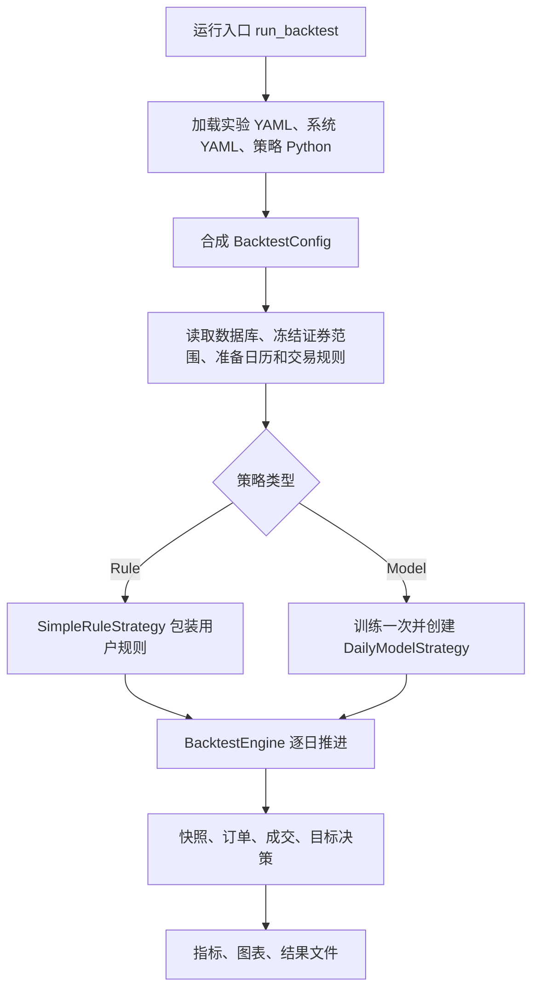
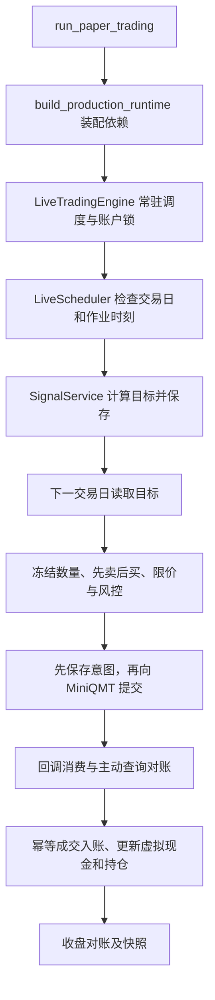

# 核心流程阅读指南

这份指南按调用关系组织代码。先看主流程函数，再沿调用进入辅助文件；不需要从每个文件第一行逐行读到最后。

配套的 [类与函数索引](类与函数索引.md) 覆盖框架、入口和用户示例中的全部类、函数、方法及嵌套定义，不包含 tests。源文件已有中文文档字符串的保留，缺少说明的定义前已补普通中文注释；复杂主流程另补了执行顺序说明。

## 先建立整体流程



两条时间线要分开：

```text
信号日 D：       截取截至 D 的历史 + 当前账户 → 策略 → 目标权重
下一交易日：     目标权重 → 目标数量 → 订单 → 审批 → 成交 → 更新账户
```

当前回测在下一 SSE 交易日收盘处理目标，按执行日原始收盘价估值和计算目标数量。目标权重不是立即下单，也不是增量买入比例。

## 第一轮：把回测主干连起来

按下表顺序读。每个文件先只看指定函数，能回答右侧问题就进入下一项。

| 顺序 | 文件与关键入口 | 要弄懂的问题 |
|---|---|---|
| 1 | [run_backtest.py · main](<D:/phD/0703量化开发/main_backtest/run_backtest.py:20>) | 命令行的实验路径如何传入总流程？异常在哪里变成退出码？ |
| 2 | [etf_backtest/experiment.py · run_experiment](<D:/phD/0703量化开发/main_backtest/etf_backtest/experiment.py:82>)、[etf_backtest/experiment.py · _run_backtest](<D:/phD/0703量化开发/main_backtest/etf_backtest/experiment.py:225>) | 配置、数据、策略、账户和执行组件如何组装？结果交给谁保存？ |
| 3 | [etf_backtest/core/engine.py · BacktestEngine.run](<D:/phD/0703量化开发/main_backtest/etf_backtest/core/engine.py:148>) | 每天的执行顺序是什么？昨天的目标在哪里暂存、今天什么时候执行？ |
| 4 | [etf_backtest/application/daily_decision.py · evaluate_daily_decision](<D:/phD/0703量化开发/main_backtest/etf_backtest/application/daily_decision.py:22>) | 如何判断调度日？怎样截取历史、创建上下文并调用策略？ |
| 5 | [etf_backtest/strategy/rule.py · SimpleRuleStrategy._generate_target](<D:/phD/0703量化开发/main_backtest/etf_backtest/strategy/rule.py:471>)、[etf_backtest/strategy/rule.py · RuleMarketData](<D:/phD/0703量化开发/main_backtest/etf_backtest/strategy/rule.py:171>) | 框架输入如何变成用户的 data？返回字典如何变成目标对象？ |
| 6 | [private_strategy/beginner_example/rule.py · Strategy.generate_weights](<D:/phD/0703量化开发/main_backtest/private_strategy/beginner_example/rule.py:68>) | 用户逻辑在哪里？它读取哪些数据、怎样表达买入、退出和保持？ |
| 7 | [etf_backtest/core/engine.py · BacktestEngine._execute_pending](<D:/phD/0703量化开发/main_backtest/etf_backtest/core/engine.py:245>) | 目标如何依次经过数量计算、报价、审批、成交和账户入账？ |
| 8 | [etf_backtest/core/account.py · Account.apply_fill](<D:/phD/0703量化开发/main_backtest/etf_backtest/core/account.py:161>)、[etf_backtest/core/account.py · Account.snapshot](<D:/phD/0703量化开发/main_backtest/etf_backtest/core/account.py:190>) | 成交如何改变现金和持仓？净值如何计算？ |

第一轮可以先把下面五种对象认清，不用记住所有字段：

| 对象 | 代表什么 | 生命周期位置 |
|---|---|---|
| `BacktestConfig` | 本次运行的配置 | 准备阶段构造，运行时读取 |
| `BacktestRuntime` | 仓库、冻结证券范围、数据集、数据入口和规则解析器 | 数据准备完成后交给引擎 |
| `StrategyContext` / `RuleMarketData` | 某个信号日策略允许读取的数据与账户视图 | 每次有效决策构造 |
| `TargetPortfolio` | 显式证券目标权重 | 从信号计算传向下一交易日执行 |
| `BacktestResult` | 快照、订单、成交、决策和审批的汇总 | 引擎结束后交给指标与输出模块 |

### 引擎每天真正做的事情

在 [etf_backtest/core/engine.py · BacktestEngine.run](<D:/phD/0703量化开发/main_backtest/etf_backtest/core/engine.py:148>) 中沿下面顺序对照：

1. 进入新交易日，调用账户结算，释放前一日 T+1 买入持仓。
2. 为当日解析交易规则、准备原始收盘价。
3. 若有绑定到今天的待执行目标，执行它并清除暂存目标。
4. 用成交后的账户和当日原始收盘价生成净值快照。
5. 若已到最后一帧，结束本日处理，不再产生无法在区间内执行的新目标。
6. 用当前账户、信号日历史和下一交易日，进入统一日决策函数。
7. 只有 `TARGET_CREATED` 才保存新的待执行目标；未到调度日和主动不调仓是不同状态。

## 第二轮：沿着主干补齐必要的依赖

### A. 配置与策略加载：自己应该改哪个文件

| 文件与入口 | 在主流程中的作用 |
|---|---|
| [etf_backtest/application/strategy_source.py · load_strategy_source](<D:/phD/0703量化开发/main_backtest/etf_backtest/application/strategy_source.py:44>) | 读取实验和系统配置，按 `case` 加载实验目录旁的 `rule.py` 或 `model.py`。 |
| [etf_backtest/application/strategy_source.py · build_backtest_config](<D:/phD/0703量化开发/main_backtest/etf_backtest/application/strategy_source.py:73>) | 提取当前策略设置，再合成总配置。 |
| [etf_backtest/experiments/config.py · UserExperimentConfig.build_case](<D:/phD/0703量化开发/main_backtest/etf_backtest/experiments/config.py:198>) | 明确指定各字段来自实验还是系统，没有隐含的字典覆盖优先级。 |
| [etf_backtest/config/schema.py · BacktestConfig](<D:/phD/0703量化开发/main_backtest/etf_backtest/config/schema.py:376>) | 统一字段类型和约束；金额、日期、路径、模式等在这里校验。 |
| [etf_backtest/strategy/loader.py · load_user_rule](<D:/phD/0703量化开发/main_backtest/etf_backtest/strategy/loader.py:50>) | 执行可信本地 Python 文件，找到 `Strategy(UserRule)` 并无参数实例化。 |
| [etf_backtest/strategy/base.py · BaseStrategy.generate_target](<D:/phD/0703量化开发/main_backtest/etf_backtest/strategy/base.py:29>) | 检查输入日期、证券和上下文，再进入策略适配器。 |
| [etf_backtest/strategy/context.py · StrategyContext](<D:/phD/0703量化开发/main_backtest/etf_backtest/strategy/context.py:103>) | 持有信号日、执行日、账户快照和辅助数据，防止用户策略直接修改正式账户。 |
| [etf_backtest/strategy/scheduler.py · PeriodicDecisionScheduler.should_decide](<D:/phD/0703量化开发/main_backtest/etf_backtest/strategy/scheduler.py:18>) | 使用序号取余判断周期调度；序号 0 即满足条件。 |

用户配置的分工：

- [入门实验 YAML](../private_strategy/beginner_example/experiment.yaml)：日期、初始资金、证券范围和 `case`。
- [private_strategy/beginner_example/rule.py · Strategy](<D:/phD/0703量化开发/main_backtest/private_strategy/beginner_example/rule.py:50>)：规则设置、自定义参数和目标计算逻辑。
- [系统 YAML](../qmt_example/configs/system.yaml)：数据源、交易成本、规则资源和输出位置等运行设置。

每个策略可以自行创建 `RuleSettings`。省略 `lookback_trading_days` 或调仓间隔会采用默认值并影响框架；`target_weight` 是方便用户读取的默认仓位，不引用它就不会自动改变输出，也不是强制仓位上限。

### B. 行情准备：data 里的内容从哪里来

按这条链读：

```text
build_backtest_runtime()
  → create_repository()
  → FrozenUniverseResolver.resolve()
  → QmtDailyRepository.load_daily_dataset()
  → DailyDataPortal(dataset)
  → load_effective_rule_resolver()
```

| 文件与入口 | 重点 |
|---|---|
| [etf_backtest/application/runtime_factory.py · build_backtest_runtime](<D:/phD/0703量化开发/main_backtest/etf_backtest/application/runtime_factory.py:101>) | 先看装配顺序，暂时把 SQL 当作“读取记录”的函数。 |
| [etf_backtest/universe/resolver.py · FrozenUniverseResolver.resolve](<D:/phD/0703量化开发/main_backtest/etf_backtest/universe/resolver.py:222>) | 显式证券与命名池取并集；按上市／退市区间确定本次纳入范围。 |
| [etf_backtest/data/mysql.py · QmtDailyRepository.load_daily_dataset](<D:/phD/0703量化开发/main_backtest/etf_backtest/data/mysql.py:995>) | 读取日历、原始行情、前复权行情、交易状态和配置的辅助数据，核对缺失与配对。 |
| [etf_backtest/data/calendar.py · SseTradingCalendar](<D:/phD/0703量化开发/main_backtest/etf_backtest/data/calendar.py:21>) | 统一交易日、下一执行日和日频帧身份。 |
| [etf_backtest/data/portal.py · DailyDataPortal.views_through](<D:/phD/0703量化开发/main_backtest/etf_backtest/data/portal.py:175>)、[etf_backtest/data/portal.py · DailyDataPortal.execution_frames](<D:/phD/0703量化开发/main_backtest/etf_backtest/data/portal.py:305>) | 前者提供截至信号日的策略历史；后者提供执行使用的原始行情帧。 |
| [etf_backtest/core/effective_rules.py · EffectiveDatedEtfRuleResolver.resolve_with_provenance](<D:/phD/0703量化开发/main_backtest/etf_backtest/core/effective_rules.py:260>) | 按证券、日期选取生效规则并保留来源。 |
| [etf_backtest/core/market.py · MarketBar](<D:/phD/0703量化开发/main_backtest/etf_backtest/core/market.py:129>)、[etf_backtest/core/market.py · MarketBarView](<D:/phD/0703量化开发/main_backtest/etf_backtest/core/market.py:179>) | 分清原始执行行情和前复权策略视图。 |

在 `mysql.py` 中，先读 `load_daily_dataset()` 的调用顺序，需要理解某个查询时再进入 `_raw_records()` 等函数。不要从最前面的数值转换函数开始读完整文件。

### C. 执行链：为什么目标仓位和最终持仓不完全相同

| 顺序 | 文件与入口 | 作用 |
|---|---|---|
| 1 | [etf_backtest/core/target.py · TargetPortfolio](<D:/phD/0703量化开发/main_backtest/etf_backtest/core/target.py:20>) | 校验并冻结显式目标权重。 |
| 2 | [etf_backtest/core/order_generator.py · OrderGenerator.generate](<D:/phD/0703量化开发/main_backtest/etf_backtest/core/order_generator.py:40>) | 从目标数量与当前数量的差生成订单，卖出优先。 |
| 3 | [etf_backtest/core/sizing.py · calculate_target_quantities](<D:/phD/0703量化开发/main_backtest/etf_backtest/core/sizing.py:16>)、[etf_backtest/core/sizing.py · calculate_order_deltas](<D:/phD/0703量化开发/main_backtest/etf_backtest/core/sizing.py:53>) | 按总资产、权重、原始估值价和整手计算数量，再减去现有持仓。 |
| 4 | [etf_backtest/core/pricing.py · TradePriceQuoteCache.quote_for](<D:/phD/0703量化开发/main_backtest/etf_backtest/core/pricing.py:46>) | 为同一执行日统一生成和缓存合法报价。 |
| 5 | [etf_backtest/core/fill.py · FillModel.create_estimate](<D:/phD/0703量化开发/main_backtest/etf_backtest/core/fill.py:134>) | 根据买卖方向、滑点和价格边界预估成交价格。 |
| 6 | [etf_backtest/core/etf_rules.py · EtfRuleEngine.approve_batch](<D:/phD/0703量化开发/main_backtest/etf_backtest/core/etf_rules.py:175>) | 检查生命周期、停牌、涨跌停、可卖量、整手、成交量上限和现金，决定批准数量。 |
| 7 | [etf_backtest/core/fill.py · FillModel.create_fill](<D:/phD/0703量化开发/main_backtest/etf_backtest/core/fill.py:218>)、[etf_backtest/core/fee.py · FeeModel.calculate](<D:/phD/0703量化开发/main_backtest/etf_backtest/core/fee.py:59>) | 用已批准数量形成成交，计算费用；未通过审批返回无成交。 |
| 8 | [etf_backtest/core/account.py · Account.apply_fill](<D:/phD/0703量化开发/main_backtest/etf_backtest/core/account.py:161>)、[etf_backtest/core/position.py · Position](<D:/phD/0703量化开发/main_backtest/etf_backtest/core/position.py:16>) | 成交才修改现金和持仓，T+1 买入数量在下一交易日释放。 |
| 9 | [etf_backtest/core/order.py · Order](<D:/phD/0703量化开发/main_backtest/etf_backtest/core/order.py:82>)、[etf_backtest/core/order.py · RuleCheckResult](<D:/phD/0703量化开发/main_backtest/etf_backtest/core/order.py:177>)、[etf_backtest/core/order.py · FillResult](<D:/phD/0703量化开发/main_backtest/etf_backtest/core/order.py:236>) | 需要查字段含义时再看这三个数据对象。 |

核心数量公式：

```text
目标数量 = floor(总资产 × 目标权重 ÷ 估值价 ÷ 整手数量) × 整手数量
委托数量差 = 目标数量 − 当前数量
```

例如总资产 100 万、目标 30%、估值价 4 元、整手 100 份，目标数量为 75,000 份；已有 20,000 份，生成买入差额 55,000 份。审批还可能因现金、费用或成交量限制缩减数量。

### D. 结果输出：收益曲线由哪些记录生成

| 文件与入口 | 作用 |
|---|---|
| [etf_backtest/experiment.py · _write_results](<D:/phD/0703量化开发/main_backtest/etf_backtest/experiment.py:265>) | 将快照和成交交给指标、图表及写入器。 |
| [etf_backtest/evaluation/backtest_metrics.py · BacktestMetrics](<D:/phD/0703量化开发/main_backtest/etf_backtest/evaluation/backtest_metrics.py:115>) | 根据逐日资产与成交计算收益、回撤、夏普、换手和交易成本等指标。 |
| [etf_backtest/evaluation/backtest_plots.py · render_backtest_plots](<D:/phD/0703量化开发/main_backtest/etf_backtest/evaluation/backtest_plots.py:63>) | 根据日结果绘制曲线，输出 PNG 字节。 |
| [etf_backtest/output/writer.py · BacktestOutputWriter.write_success](<D:/phD/0703量化开发/main_backtest/etf_backtest/output/writer.py:289>) | 写入固定结果文件，完成后从临时目录原子发布。 |

## 编写自己的规则策略：只需优先掌握这些接口

入口仍是 [private_strategy/beginner_example/rule.py · Strategy.generate_weights](<D:/phD/0703量化开发/main_backtest/private_strategy/beginner_example/rule.py:68>)。实际编写时检查四件事：

1. 输入是否足够：`lookback`、`latest.trade_date`、停牌和缺失值如何处理。
2. 决策时机：框架每隔多少交易日调用，策略内部是否还需择时。
3. 目标含义：输出绝对目标权重，明确列出需要退出的证券。
4. 执行约束：返回目标不等于保证成交，最终以订单审批和成交记录解释结果。

| 规则返回值 | 实际意义 |
|---|---|
| `{}` 或 `NO_REBALANCE` | 本次不生成调仓目标，已有持仓继续保留。 |
| `{"SH.510300": "0"}` | 为这一只证券明确设零目标，后续尝试清仓。 |
| `{"SH.510300": "0.30"}` | 为这一只证券设 30% 的绝对目标，未列出的证券保持数量。 |

可对照的用户示例：

- [private_strategy/beginner_example/rule.py · Strategy.generate_weights](<D:/phD/0703量化开发/main_backtest/private_strategy/beginner_example/rule.py:68>)：动量打分和阈值筛选；不会自动卖掉旧赢家，也不会在无候选时自动空仓。
- [private_strategy/shape_choice/rule.py · Strategy.generate_weights](<D:/phD/0703量化开发/main_backtest/private_strategy/shape_choice/rule.py:50>)：长期均线、前期高低点突破、明确退出和持仓名额控制。
- [private_strategy/huijin_multi_example/rule.py · Strategy.generate_weights](<D:/phD/0703量化开发/main_backtest/private_strategy/huijin_multi_example/rule.py:287>)：指数回撤、ETF 份额变化、信号覆盖比例、汇金估计持仓以及分阶段建减仓。

## 使用模型策略时，增加这一条阅读路线

```text
model.py 的 MODEL_SETTINGS、Features、Model
  → load_user_model_components()
  → experiment._build_model()
  → DailyModelDatasetBuilder.build()
  → Torch 或 XGBoost 工作流 fit()
  → DailyModelStrategy._generate_target()
  → 组合政策 allocate()
  → 共用 BacktestEngine
```

| 文件与入口 | 要看懂的内容 |
|---|---|
| [etf_backtest/strategy/model.py · load_user_model_components](<D:/phD/0703量化开发/main_backtest/etf_backtest/strategy/model.py:210>) | 固定名称组件如何加载，Python 设置如何校验。 |
| [etf_backtest/strategy/model_contracts.py · FeatureBuilder](<D:/phD/0703量化开发/main_backtest/etf_backtest/strategy/model_contracts.py:497>)、[etf_backtest/strategy/model_contracts.py · PredictorBundle](<D:/phD/0703量化开发/main_backtest/etf_backtest/strategy/model_contracts.py:544>) | 特征接口、样本主键、模型元数据和预测包约定。 |
| [etf_backtest/strategy/model_data.py · DailyModelDatasetBuilder.build](<D:/phD/0703量化开发/main_backtest/etf_backtest/strategy/model_data.py:41>) | 信号日样本如何切分、未来收益标签如何构造。 |
| [etf_backtest/strategy/model_training.py · DailyTorchWorkflow.fit](<D:/phD/0703量化开发/main_backtest/etf_backtest/strategy/model_training.py:391>) | 训练集拟合标准化器、训练、验证早停和最佳权重保存。 |
| [etf_backtest/strategy/xgboost_training.py · DailyXGBoostWorkflow.fit](<D:/phD/0703量化开发/main_backtest/etf_backtest/strategy/xgboost_training.py:298>) | 树模型训练、验证早停及 UBJ 产物保存。 |
| [etf_backtest/strategy/model_runtime.py · DailyModelStrategy._generate_target](<D:/phD/0703量化开发/main_backtest/etf_backtest/strategy/model_runtime.py:99>) | 每日特征、预测、分配和最终完整证券目标如何衔接。 |
| [etf_backtest/strategy/portfolio.py · TopKPortfolio.allocate](<D:/phD/0703量化开发/main_backtest/etf_backtest/strategy/portfolio.py:202>)、[etf_backtest/strategy/portfolio.py · CustomPortfolio.allocate](<D:/phD/0703量化开发/main_backtest/etf_backtest/strategy/portfolio.py:264>) | 预测分数如何转换为权重。 |

先选择自己实际使用的一个后端读，不必同时读完 Torch 和 XGBoost 的序列化细节。

## 对接模拟盘：复用信号，替换执行方式

模拟盘也使用统一日决策，但成交来自 MiniQMT，不能套用回测的收盘模拟成交过程。



| 顺序 | 文件与入口 | 核心问题 |
|---|---|---|
| 1 | [run_paper_trading.py · main](<D:/phD/0703量化开发/main_backtest/run_paper_trading.py:13>)、[etf_backtest/live/config.py · LiveConfig](<D:/phD/0703量化开发/main_backtest/etf_backtest/live/config.py:286>) | 账户、策略、资金、调度和模型产物在哪里指定？ |
| 2 | [etf_backtest/live/service.py · build_production_runtime](<D:/phD/0703量化开发/main_backtest/etf_backtest/live/service.py:93>) | 券商、行情、数据库、信号、风控和作业如何组装？ |
| 3 | [etf_backtest/live/engine.py · LiveTradingEngine.run_forever](<D:/phD/0703量化开发/main_backtest/etf_backtest/live/engine.py:111>)、[etf_backtest/live/scheduler.py · LiveScheduler.tick](<D:/phD/0703量化开发/main_backtest/etf_backtest/live/scheduler.py:79>) | 如何常驻运行、按时触发并防止同一账户多进程重复执行？ |
| 4 | [etf_backtest/live/signals.py · SignalService.evaluate](<D:/phD/0703量化开发/main_backtest/etf_backtest/live/signals.py:162>)、[etf_backtest/live/account_adapter.py · adapt_virtual_account](<D:/phD/0703量化开发/main_backtest/etf_backtest/live/account_adapter.py:85>) | 用哪份虚拟资金和持仓计算信号？与回测共用哪部分？ |
| 5 | [etf_backtest/live/jobs.py · LiveDailyJobs._prepare_strategy_signal](<D:/phD/0703量化开发/main_backtest/etf_backtest/live/jobs.py:380>)、[etf_backtest/live/jobs.py · LiveDailyJobs._execute_pending_target](<D:/phD/0703量化开发/main_backtest/etf_backtest/live/jobs.py:449>) | 信号如何落库，次日如何按卖出、买入阶段执行？ |
| 6 | [etf_backtest/live/execution/planner.py · LiveRebalancePlanner.plan](<D:/phD/0703量化开发/main_backtest/etf_backtest/live/execution/planner.py:134>)、[etf_backtest/live/execution/near_close_limit.py · NearCloseLimitPolicy.calculate](<D:/phD/0703量化开发/main_backtest/etf_backtest/live/execution/near_close_limit.py:29>) | 如何扣除未完成委托占用、计算数量并选择限价？ |
| 7 | [etf_backtest/live/risk.py · LiveRiskManager.check](<D:/phD/0703量化开发/main_backtest/etf_backtest/live/risk.py:30>)、[etf_backtest/live/jobs.py · LiveDailyJobs._submit_intent](<D:/phD/0703量化开发/main_backtest/etf_backtest/live/jobs.py:898>) | 何时允许下单？为什么必须先保存 SUBMITTING？ |
| 8 | [etf_backtest/live/broker/miniqmt.py · MiniQmtBrokerGateway](<D:/phD/0703量化开发/main_backtest/etf_backtest/live/broker/miniqmt.py:66>)、[etf_backtest/live/market/xtdata.py · XtDataQuoteProvider](<D:/phD/0703量化开发/main_backtest/etf_backtest/live/market/xtdata.py:22>) | SDK 如何映射成框架订单、成交和报价？ |
| 9 | [etf_backtest/live/broker/callbacks.py · BrokerEventConsumer.process](<D:/phD/0703量化开发/main_backtest/etf_backtest/live/broker/callbacks.py:164>)、[etf_backtest/live/reconciliation.py · ReconciliationService.reconcile](<D:/phD/0703量化开发/main_backtest/etf_backtest/live/reconciliation.py:56>) | 回报和查询如何相互补偿，未知结果如何处理？ |
| 10 | [etf_backtest/live/persistence/repository.py · LiveStateRepository.record_strategy_trade_if_absent](<D:/phD/0703量化开发/main_backtest/etf_backtest/live/persistence/repository.py:1169>)、[etf_backtest/live/state.py · OrderIntentStatus](<D:/phD/0703量化开发/main_backtest/etf_backtest/live/state.py:23>) | 如何避免重复成交入账，如何保存和恢复状态？ |

这条路线中最值得精读的是 `live/jobs.py`。先看 `_execute_pending_target()`，再沿 `_execute_strategy_side()` → `_submit_intent()` → `_wait_for_phase()` 追踪。最后读 `eod()`，将一个交易日闭环接起来。

本地意图常见路径：

```text
PLANNED → SUBMITTING → SUBMITTED → COMPLETED / INCOMPLETE
                 └→ SUBMIT_UNKNOWN → 暂停并等待对账确认
```

明确拒绝会进入 `REJECTED`。上述图仅表示主要路径；恢复时允许哪些转换以仓库 `_set_intent_status()` 为准。提交未知不能直接重发；券商已收到委托但客户端没收到结果时，重发可能形成重复订单。

## 阅读时应按实现理解的几个边界

- 规则接口中的“省略证券”与“显式零权重”意义不同。入门示例并非自动清掉全部旧仓位的完整轮动策略。
- 原始价用于回测估值和执行，前复权价用于策略特征。日期截断不等于完整的历史时点数据保证；当前结果明确声明 `pit_compliant=False`，资产池分类来自当前主表快照。
- 汇金接口实际按报告期 `EndDate` 截断，不是按独立披露日期截断。不能仅凭“报告期早于信号日”推断当时已公布。
- 模型标签用某证券后两条行情的收盘价比值；数据切分按信号日完成，标签日期可能跨越切分边界。`trained_through` 也是训练样本的信号截止日。
- 模型组合返回空分配／无正权重时，当前 `DailyModelStrategy` 会报错。规则策略返回空映射则表示不调仓，两者不要混用。
- 模拟盘配置当前是单策略虚拟账本。Rule 的历史加载起点与回测 `_load_start()` 不同；准备自己的模拟盘实验时应核对早期历史是否足够、调度锚点是否符合预期。

## 怎样用这份指南继续学

最快的一条路线是：先完成第一轮八项，再看第二轮的数量、审批和账户链路；写自己的规则时查询 `RuleMarketData` 和示例；需要模拟盘时按十项路线单独串起来。

遇到不认识的类或函数，在 [类与函数索引](类与函数索引.md) 搜索名称即可跳到定义。参数转换、路径校验、元数据序列化等辅助函数已有中文说明，可以在主流程调用到时再读。

模型的 CPU/GPU 选择见 [Model 设备配置](MODEL_API.md#选择-cpu-或-gpu)。从各策略的
`MODEL_SETTINGS.training.device` 追到 Torch／XGBoost 工作流的 `fit()`，可以看到网络、
输入张量或 Booster 如何使用所选设备；模拟盘则从 `strategy.model.device` 经
`build_production_runtime()` 传到模型加载函数。保存文件中的训练身份与加载时的推理设备分别管理。
